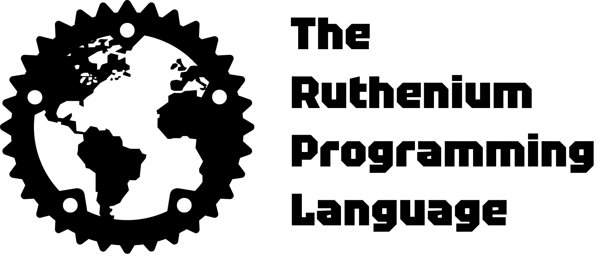

   
    
   <a href="https://github.com/ruthenium-lang/ruthenium/wiki/">
      <b>Explore the docs »</b>
   </a>
    

   <a href="https://github.com/ruthenium-lang/ruthenium/wiki/Examples">📖 See examples</a>
   ·
   🧪 Playground (in the other branch)
   ·
   <a href="https://github.com/ruthenium-lang/ruthenium/issues">💡 Suggest Features</a>

     
   ⭐ Star us on GitHub — it motivates us a lot!

 

> [!IMPORTANT]
> **CHECK THE WIKI BEFORE GIVING YOUR FEEDBACK PLEASE** 
> https://github.com/ruthenium-lang/ruthenium/wiki/

**Ruthenium** is a programming language designed for the next era of programming. It was
designed as a simple and flexible language based on languages like C and JavaScript.

---

### 🤔 Why should I choose Ruthenium?

| Feature                    | Ruthenium          | Rust             | JavaScript        | C                  |
|----------------------------|--------------------|------------------|-------------------|--------------------|
| 🧠 Learning curve          | Easy               | Medium/Hard      | Easy              | Medium             |
| ⚡ Performance              | Like assembler     | High             | Medium (interpreted) | Very high       |
| 🛡️ Memory safety           | Hybrid Rust/C      | Strong (by design)| Weak              | Manual             |
| 🔧 Manual memory control   | Optional           | Yes              | No                | Yes                |
| 🔄 Syntax style            | C/JS hybrid        | C-like           | C-like            | C                  |
| 🧰 Standard library        | Modular (growing)  | Rich             | Very rich         | Minimal            |
| 🧪 Playground support      | Soon               | Available        | Yes               | Indirect (via tools)|
| 🧩 Metaprogramming         | Yes                | Limited (macros) | Yes               | No                 |
| 🔨 Low-level capabilities  | Yes                | Yes              | No                | Yes                |
| 🚀 Ideal use cases         | Everything | Systems programming | Web dev, scripting | OS/devices      |

---

### 🚀 Vision

Ruthenium aims to bring **the power and performance of low-level languages** with the **ease and readability of high-level scripting**, supporting both interpreted and compiled workflows. With support for plugins, raw memory operations, and fine control over your environment, Ruthenium is perfect for creators who want to push the limits of what a language can do.

🛠️ Want to contribute? Check out the [issues](https://github.com/ruthenium-lang/ruthenium/issues) or start with the [examples](https://github.com/ruthenium-lang/ruthenium/wiki/Examples).

📌 Don't forget to ⭐ star us — every star counts to grow the community!
